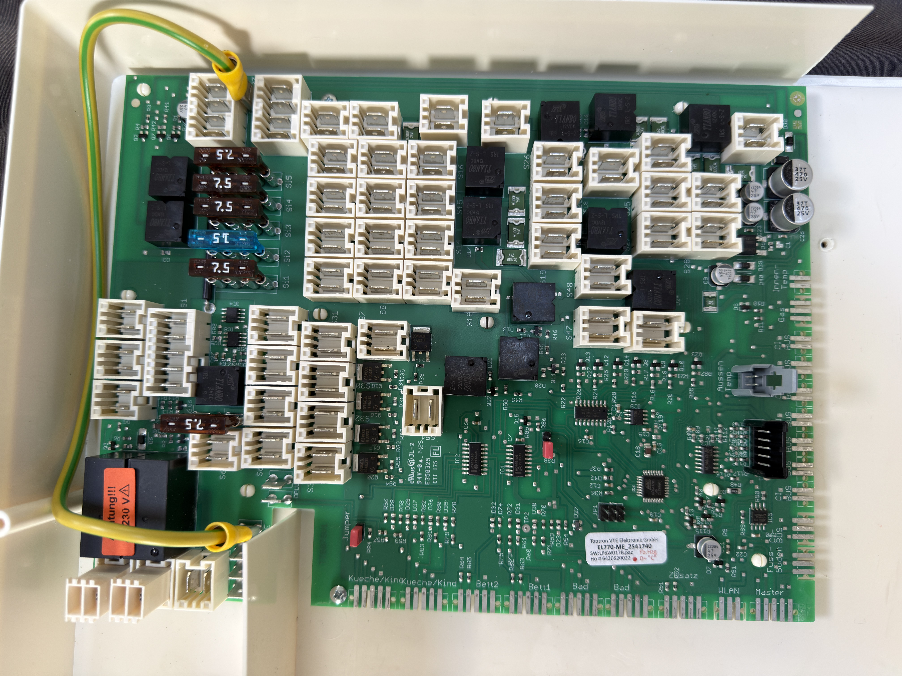
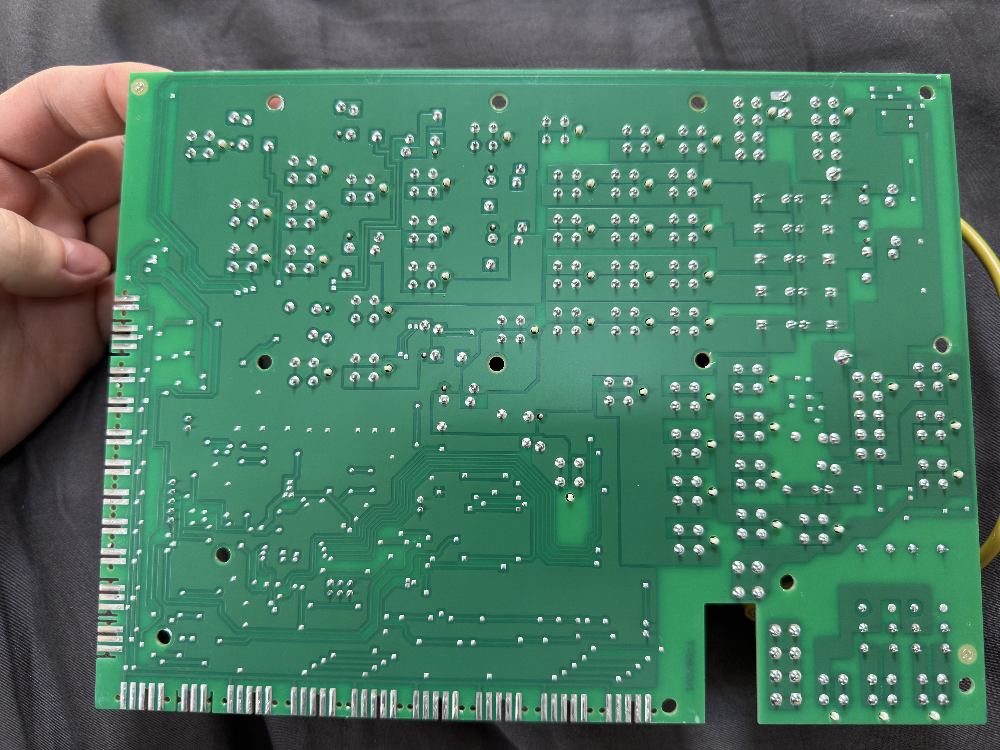
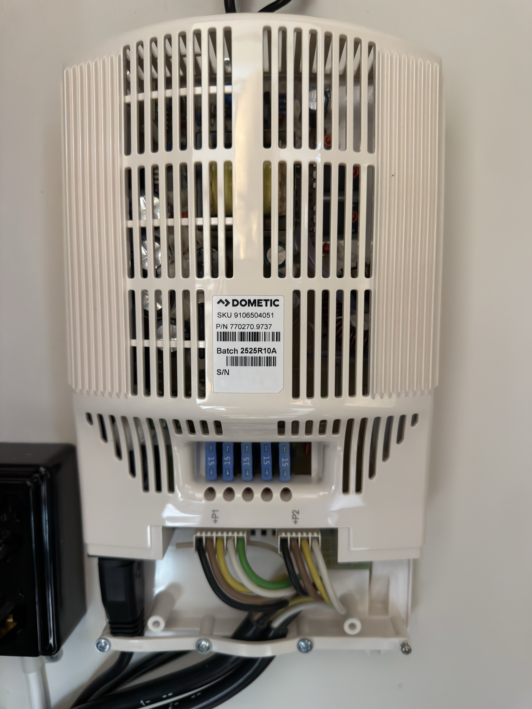
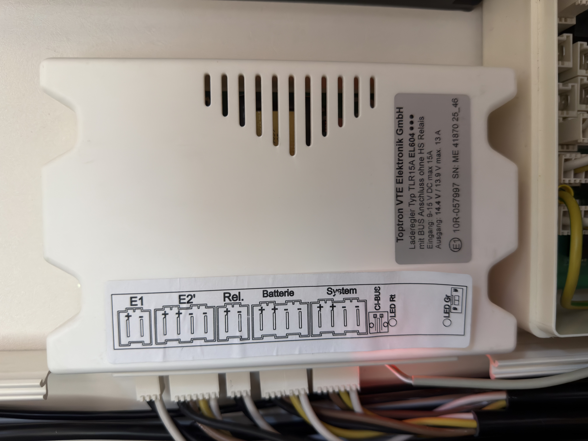
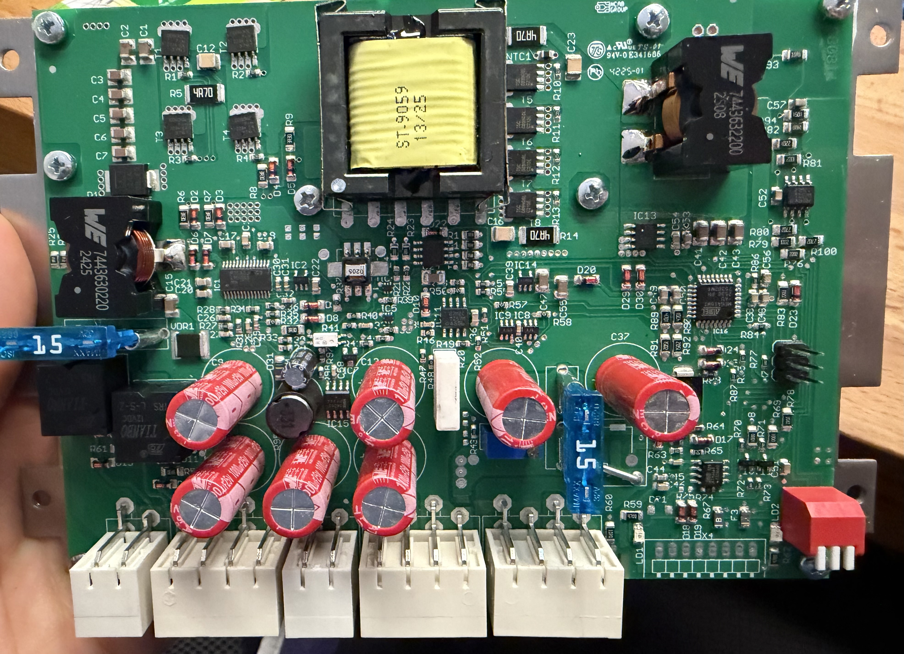
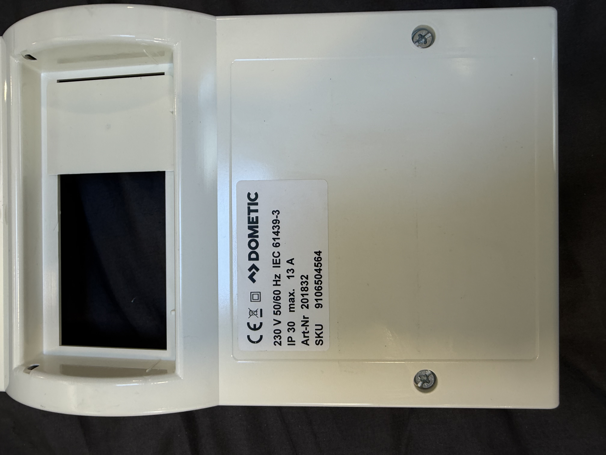
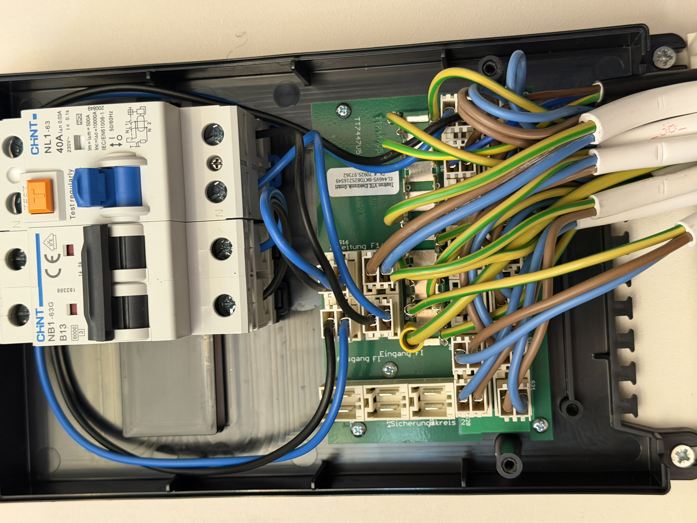
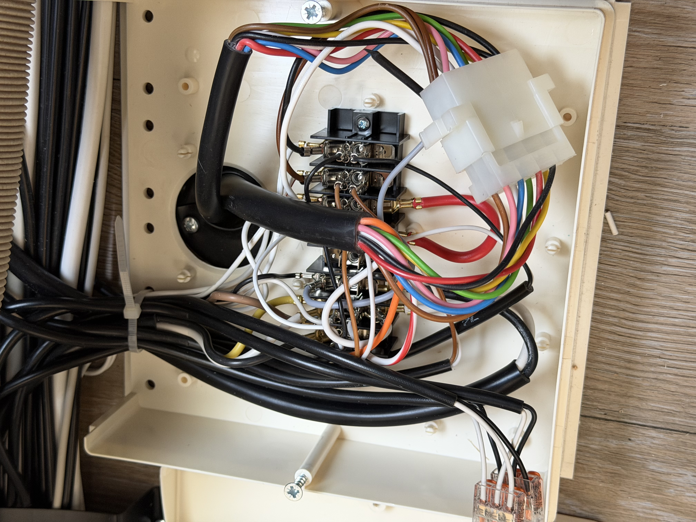

# Hobby/Toptron EL770 unofficial docs
## Warnings and safety
> [!WARNING]
> 
> Unofficial notes and reverse-engineered observations for a Toptron EL770-ME_2541740 unit installed in a Hobby caravan.
> 
> This project is not affiliated with, endorsed by, or supported by Toptron, Hobby, Dometic, or any related manufacturer.
> 
> Connector names, labels, and product names are used only to identify the components being described.
> 
> All diagrams, photos, measurements, and tables are my own work unless explicitly stated otherwise.
> 
> Use at your own risk.

> [!CAUTION]
> 
> Parts of this system carry 230 V AC mains voltage and can be dangerous or lethal.
> 
> This repository is documentation of observations, not an installation guide.
> 
> Work on mains voltage systems must only be performed by qualified persons and according to applicable regulations.

## References
Official Toptron/Hobby documents are not mirrored in this repository. If referenced, they are linked only.

## License
Documentation, photos, diagrams, measurements and tables in this repository are licensed under CC BY-SA 4.0 unless otherwise stated.

That means you may share and adapt the material, including commercially, as long as you give appropriate credit and distribute adapted material under the same or a compatible license.

## How I got to this
Some time ago I got my Hobby EXCELLENT 495 WFB 2026. I am planning to migrate parts of the electrical system to Victron components. To do that safely, I first needed to understand how the existing system is wired and how the individual boxes are connected.

This repository contains my personal findings from that process. The information may be incomplete or wrong. I may have misunderstood parts of the system, measured something incorrectly, or made mistakes while transferring my notes into this documentation.

## Hardware Basics
### Light box
I call it the *light box*, even though it can control much more than lights, because it is easier to have a short name for it. On the board of my version it reads the following:
> Toptron VTE Elektronik GmbH
> 
> EL770-ME_2541740
> 
> SW: LP6W=17B.pac
> 
> Ho # 64 20 52 00 22
> 
> Fb.Hzg D+ "C"

| Board front | Board back |
|--|--|
|  |  |

### Power supply
Attached to it is a power supply with the following labels:
> Dometic
> 
> Model No. SMP192-05
> 
> SKU 91 06 50 40 51
> 
> P/N 77 02 70.97 37
> 
> Batch 25 25 R1 0A
> 
> Input 230 V / 50 Hz / 3,5 A
> 
> Output 12.7 V DC / 35 A / 450 W

| Box front |
|--|
|  | 

### Charge controller
The third important component is the charge controller with the following info:
> Toptron VTE Elektronik GmbH
> 
> Laderegler Typ TLR15A EL604 mit BUS
> 
> Anschluss ohne HS Relais
> 
> Input: 9 - 15 V DC max. 15 A
> 
> Output: 14.4 V / 13.9 V max. 13 A

| Box front | Board front |
|--|--|
|  |  |

### Grid power box
This is the box where the ⚠️ 230 V AC system is distributed. The fuses are also located here. The power from the external grid enters this box first and is then distributed through the fuses.

Plastic case:
> Dometic
> 
> 230 V 50/60 Hz IEC 61439-3
> 
> IP 30 max. 13 A Art-Nr 201832
> 
> SKU 9106504564

Board inside:
> Toptron VTE Elektronik GmbH
> 
> EL446V5-BKT0825216549
> 
> DL #70925.97362

| Box front | Board front |
|--|--|
|  |  |

### E-Trailer box
It is a third-party system for controlling the trailer with an app and for viewing information about the trailer.

### Trailer box
This is the box where the wires from the towing vehicle go first. They are distributed from there. In my caravan, this box is located in the front area.

| Box front |
|--|
|  | 

## Light box
Some of these ports are not used in my case and some numbers do not exist on the board.

| From | Cable | To | Notes |
|--|--|--|--|
| S1 | Color: black Diameter: 10.8 mm Wires: black, brown, yellow, white, green with 2.5 mm^2 | Device: Power supply Port: +P1 | The positive part of the 12 V rail. Every wire has its own fuse in the power supply. |
| S2 | Color: black Diameter: 10.8 mm Wires: black, brown, yellow, white with 2.5 mm^2 | Device: Power supply Port: +P2 | The negative part of the 12 V rail or GND |
| S3 | - | - | Not used |
| S4 | Color: black Diameter: 8 mm Wires: brown 1.5 mm^2 | LED bar under the kitchen cabinet | Not dimmable |
| S5 | - | - | Not used |
| S6 | - | - | Not used |
| S7 | Color: black Diameter: 5.5 mm Wires: black, white with 0.75 mm^2 |  ❓ | ❓ |
| S8 | Color: black Diameter: 4 mm Wires: black, white with 22 AWG | Two-pin power connector of the E-Trailer box | - |
| S9 | - | - | Not used |
| S10 | - | - | Not used |
| S11 | - | - | Not used |
| S12 | - | - | Not used |
| S13 | - | - | Not used |
| S14 | Color: black Diameter: 7.5 mm Wires: black, white with 1.5 mm^2 | ❓ | ❓  |
| S15 | - | - | Not used |
| S16 | - | - | Not used |
| S17 | ❓ | ❓ | ❓ |
| S18 | Color: black Diameter: 5.5 mm Wires: black, white with 0.75 mm^2 |  |  |
| S19 | Color: black Diameter: 5.5 mm Wires: black, white with 0.75 mm^2 |  |  |
| S20 | Color: black Diameter: 5.5 mm Wires: black, white with 0.75 mm^2 |  |  |
| S21 | - | - | Not used |
| S22 | Color: black Diameter: 5.5 mm Wires: black, white with 0.75 mm^2 |  |  |
| S23 | Color: black Diameter: 5.5 mm Wires: black, white with 0.75 mm^2 |  |  |
| S24 | - | - | Not used |
| S25 | Color: black Diameter: 5.5 mm Wires: black, white with 0.75 mm^2 |  |  |
| S26 | Color: black Diameter: 8 mm Wires: black, white with 1.5 mm^2 |  |  |
| S27 | Color: black Diameter: 5.5 mm Wires: black, white with 0.75 mm^2 |  |  |
| S28 | Color: black Diameter: 5.5 mm Wires: black, white with 0.75 mm^2 |  |  |
| S29 | Color: black Diameter: 5.5 mm Wires: black, white with 0.75 mm^2 |  |  |
| S30 | Color: black Diameter: 5.5 mm Wires: black, white with 0.75 mm^2 |  |  |
| S31 | Color: black Diameter: 6.2 mm Wires: black, white with 0.75 mm^2 |  |  |
| S32 | Color: black Diameter: 6.2 mm Wires: black, white, yellow, brown with 0.75 mm^2 |  |  |
| S33 | Related to S32 |  |  |
| S34 | - | - | Not used in my unit as far as currently known. ⚠️ 230 V AC. Possibly switched outputs from S36, e.g. for optional equipment. |
| S35 | - | - | Not used in my unit as far as currently known. ⚠️ 230 V AC. Possibly switched outputs from S36, e.g. for optional equipment. |
| S36 | Color: white Diameter: 8 mm Wires: blue, brown, yellow/green with 1.5 mm^2 Voltage: ⚠️ 230 V AC | Device: Grid power box Port: S9 | Cable is present, but I have not yet identified any connected load on S34/S35 in my unit. |
| S37 | - | - | Not used |
| S38 | Color: white Diameter: 9.2 mm Wires: black, white with 2.5 mm^2 | Device: Charge controller Port: E1 | ❓ |
| S39 | Color: white Diameter: 9.2 mm Wires: black, white with 2.5 mm^2 | Device: Charge controller Port: Rel. | ❓ |
| S40 | Color: white Diameter: 5.2 mm Wires: black, white with 0.75 mm^2 | Device: E-Trailer box Port: ❓ | ❓ |
| S41 | Color: white Diameter: 10.8 mm Wires: black, white, yellow, brown with 2.5 mm^2 | Device: Charge controller Port: System | ❓ |
| S42-S46 | - | - | No such connector numbers on my board |
| S47 | Color: black Diameter: 5.5 mm Wires: black, white with 0.75 mm^2 | Power of the lamp called Zusatz/Extra 1 | - |
| S48 | - | - | Not used |
| S49-S50 | - | - | No such connector numbers on my board |
| S51 | - | - | Not used |
| S52 | - | - | No such connector numbers on my board |
| S53 | - | - | Not used |
| S54-S59 | - | - | No such connector numbers on my board |
| S60 | Color: black Diameter: 5.5 mm Wires: black, white with 0.75 mm^2 | Power of my Truma display of the heating system | - |
| S61 | Color: black Diameter: 9.1 mm Wires: black, white with 2.5 mm^2 |  |  |
| S62 | Color: black Diameter: 5.5 mm Wires: black, white with 0.75 mm^2 |  |  |
| S63 | - | - | Not used |
| S64 | - | - | Not used |
|  |  |  |  |
|  |  |  |  |
|  |  |  |  |
|  |  |  |  |
